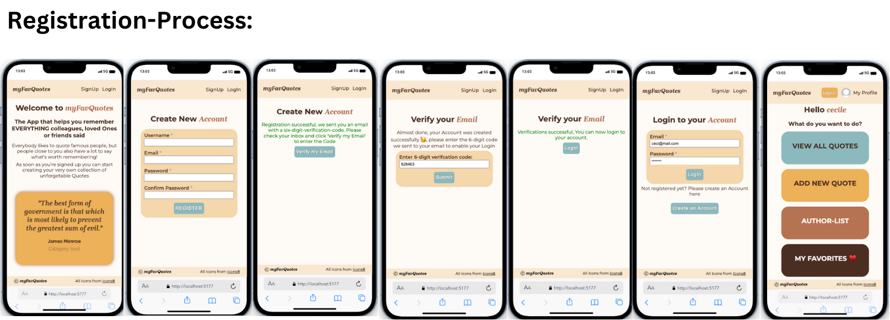
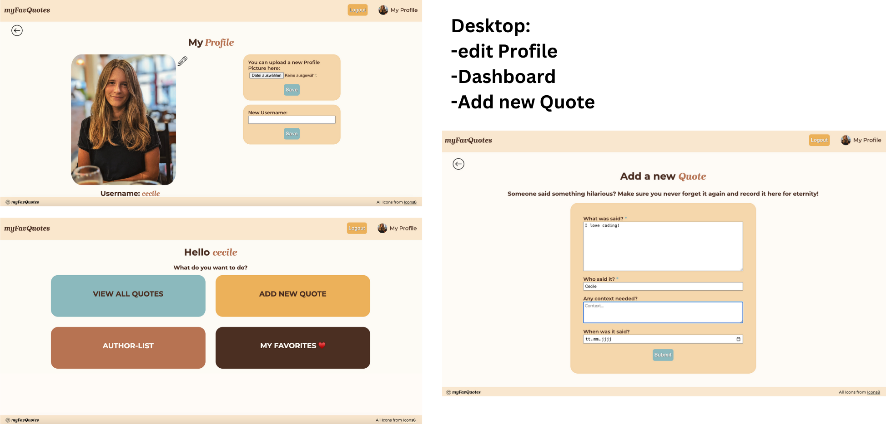
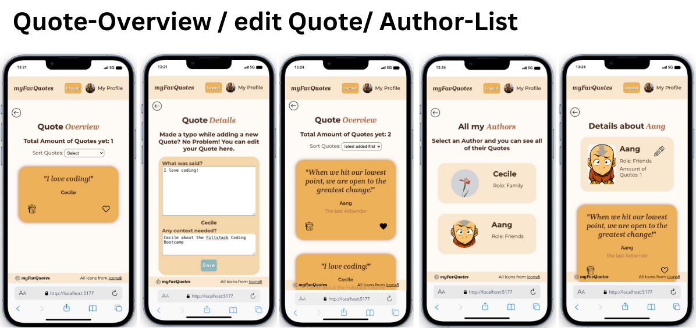

# Fullstack-Project: myFavQuotes ♥️

This project was created as part of a Full-Stack Webdeveloper bootcamp from supercode while the backend part of the course.

-   The learning objective of the project:
-   Development of an own application with the MERN stack
-   Structure of the backend with the CRUD methods in a layered architecture
-   Implementation of a functioning authentication, with registration, verification mail (nodemailer), login, tokens and refresh tokens in the http only cookies.
-   Implementation of the frontend with React.js that offers the user robust functionalities

## How does myFavQuotes work? ⚙️

Everybody likes to quote famous people, but people close to us also have a lot to say what's worth remembering!
As soon as you're signed up you can start creating your very own collection of unforgetable Quotes.
Someone said something hilarious? Make sure you never forget it again and record it in the myFavQuotes-App for eternity!

-   Each user has their own account. They can add a profile picture and change their profile picture and user name at any time.
-   The User can ADD new Quotes by entering WHAT was said, WHO said it, in which CONTEXT was it said and WHEN was it said.
-   The user has an overview of all added quotations.
-   The user can like, edit, sort by date or delete quotes.
-   All liked quotes appear on the favorites list.
-   The user has an overview of all his authors. If the user clicks on an author, he sees all quotes from this author and can assign both a profile picture and a role to the author.
-   The user can also delete an author. If this is done, all quotes from this author are also deleted.

## Demo:

-   For the email verification I use googleapi. The refresh tokens expire very fast, that's why you can Login to my App with following Test-Login:
-   email: ceci@mail.com
-   password: ceci123

https://myfavquote-fullstack-project-frontend.onrender.com/

## Screenshots 📸

## Copatible Screensizes 📱🖥️

-   Responsive Website optimized for Desktops and Smartphones

## Tech Stack 💻

-   React.js
-   Vite
-   VS Code
-   HTML
-   SCSS
-   JavaScript
-   Git
-   Node.js
-   Express.js
-   MongoDB
-   mongoose
-   Trello

## Author 🤵‍♀️

-   [@cecilestaller](https://github.com/cecilestaller)

## Icons 🤍

https://icons8.com

## API

https://api-ninjas.com/api/quotes
